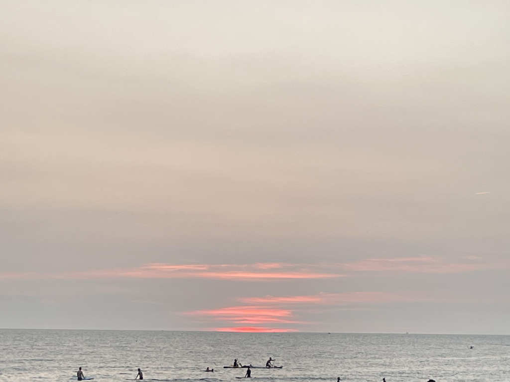

## #TeamSeas

作為一位安平人，我的老家離海邊騎車只要幾分鐘

心情不好時看看大海，總能讓我的心情變得很好

但是，作為一個普通民眾

海洋污染這件事情總讓人感覺距離自己很遙遠

除了到海邊時看到垃圾隨手撿起之類的事情

我們能做的並不多

## 三千萬磅的垃圾

2021 年的現在，外國知名 Youtuber Mr.Beast 舉辦了一個活動

透過科技的力量，我們可以用更有效率的方式清理海洋

更了不起的是，在網路世界，這件事情人人都可以出力

現在只要到 <https://teamseas.org/> 

每捐出一塊美金，海洋中就會少一磅（453.59237 公克）垃圾。

teamseas 的目標是在 2021 年結束之前

清理海洋中的三千萬磅垃圾

雖然海中的垃圾絕對不止三千萬磅，但這是一個開始

證明透過網路的連結，和科技的力量，我們可以真實的改善我們的環境。

歡迎大家一起團結合作，讓大海變得更加乾淨！
